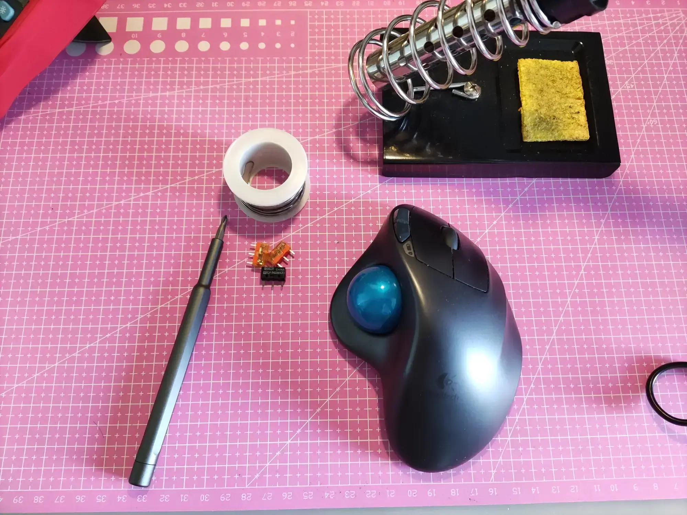
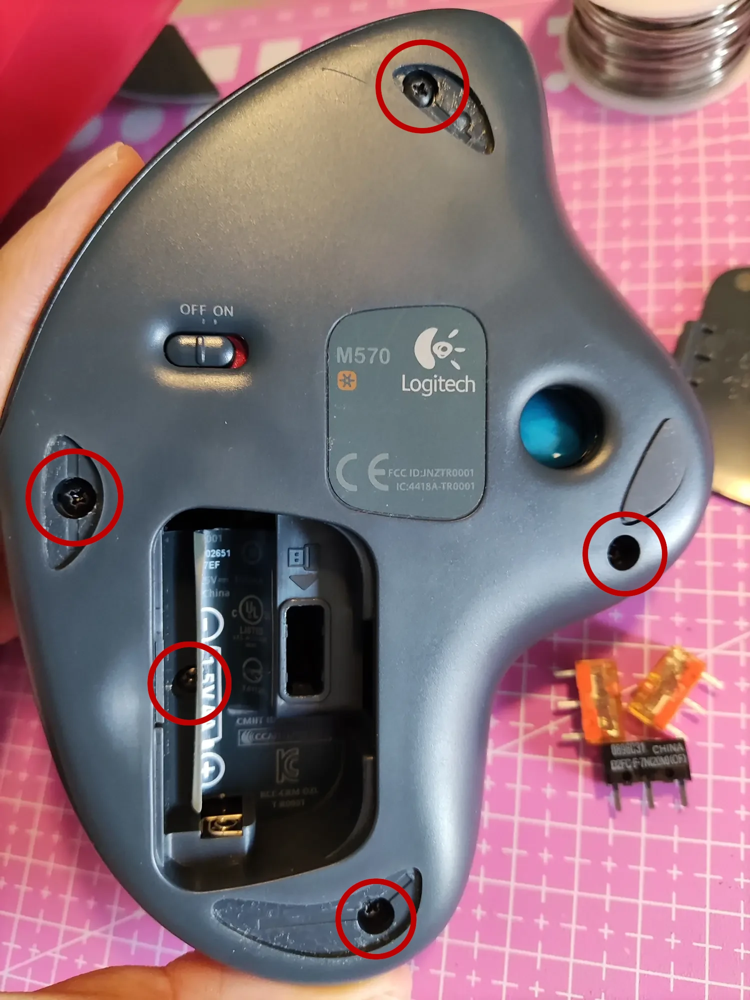
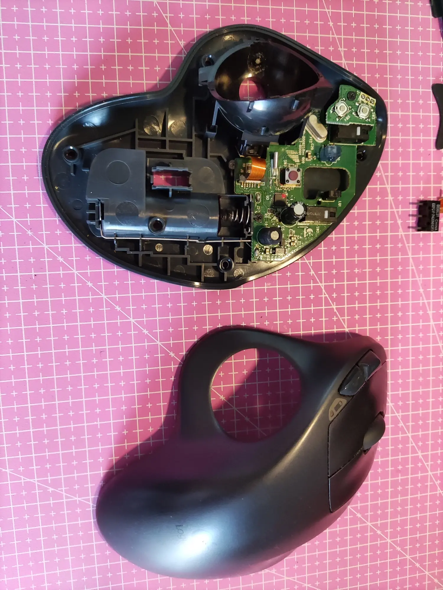
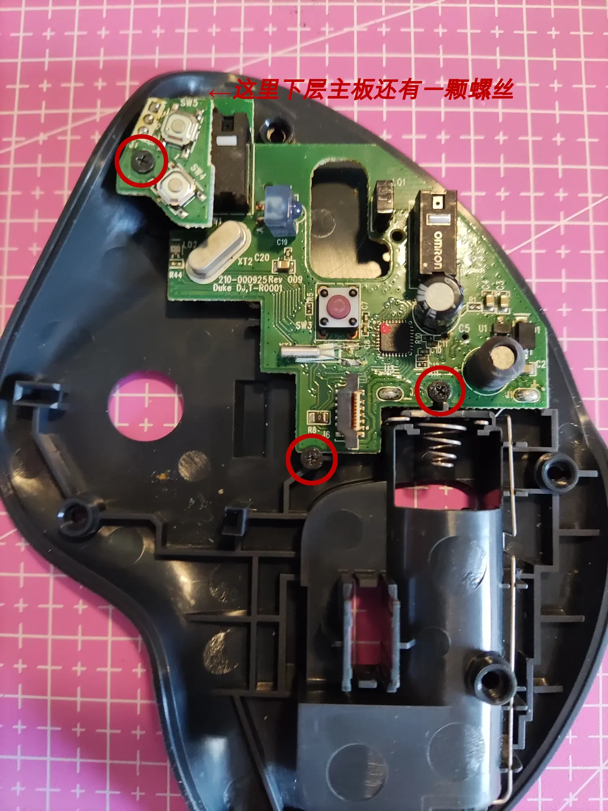
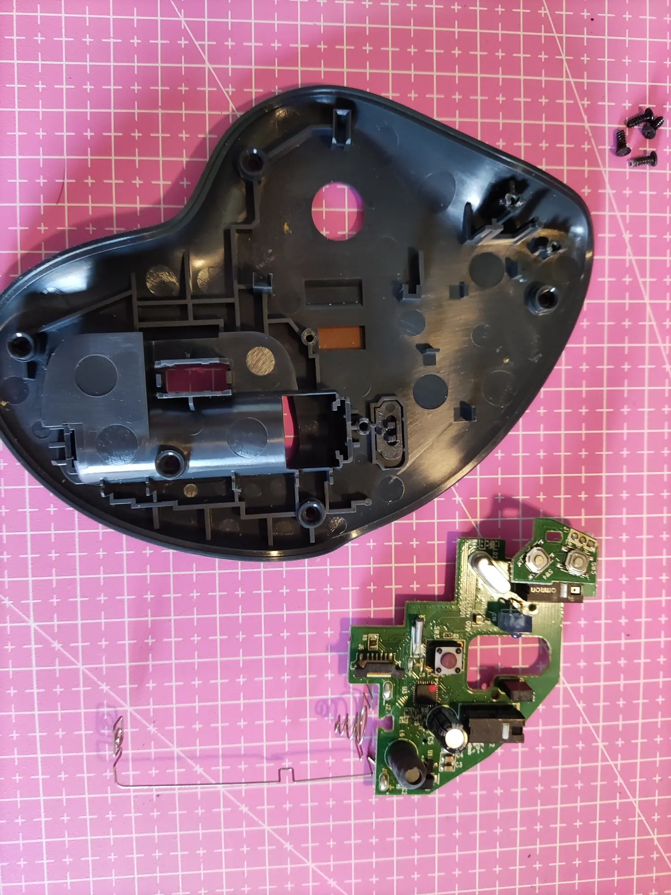
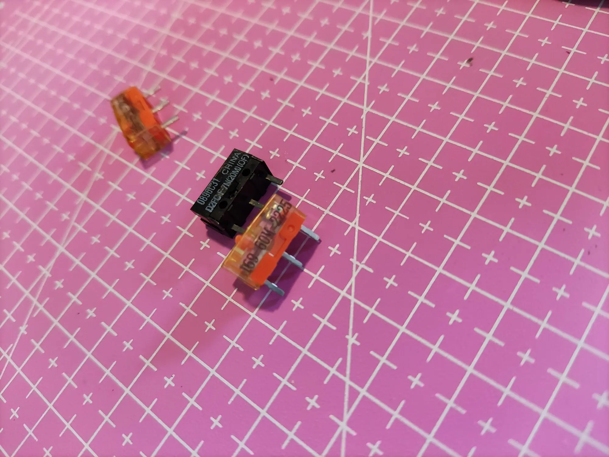
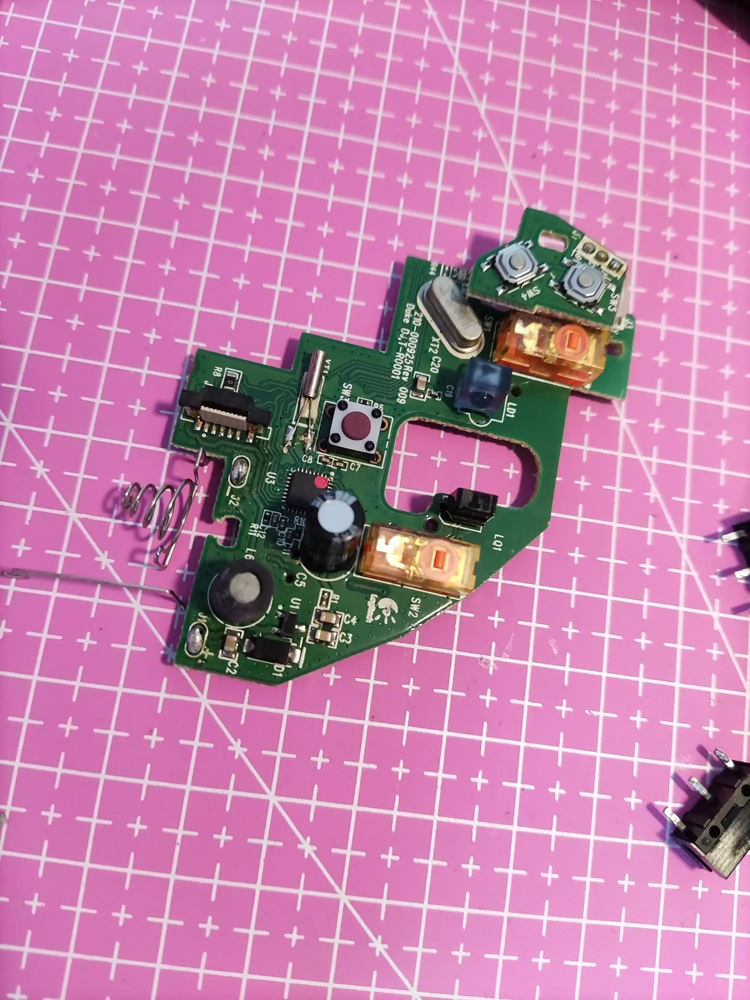
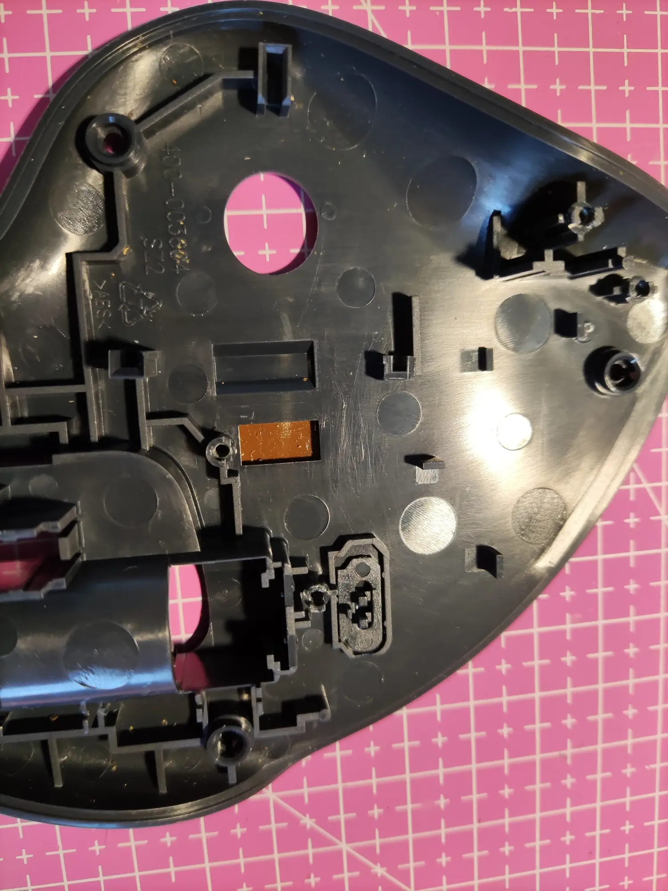
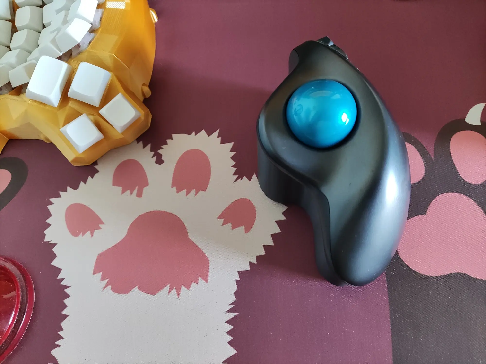

# M570-repair

---
罗技 Logitech M570 双击问题更换左右键微动.

## 准备材料
十字螺丝刀,电烙铁,更换的微动,还有M570 鼠标.

## 拆主板
**拆开外壳**只需要拧下图的5颗螺丝.注意拆外壳前取出轨迹球.

拆开外壳后取下轨迹球座.注意排线母座小卡子上提后再拔出排线.

主板由4颗螺丝固定在鼠标底壳,取下主板时注意主板与电池仓正负极连线的钢丝焊接在一起,需一同拿出来.

## 更换微动
原装微动是**欧姆龙D2FC-F-7N**,理论上这样三脚长方体微动都可以通用.本人只用过**欧姆龙D2FC-F-7N(20M)(OF)**和**TTC 防尘金微动 60M**.

下图是更换微动后的效果,用了TTC的微动.更换微动时最好用刀头烙铁,来回拖几次三个脚就很容易把微动拆下来.

装回去的时候注意鼠标底壳上的开关滑块活动的,要对应主板上的开关安装到位.

换完后满血复活,**NICE!**

